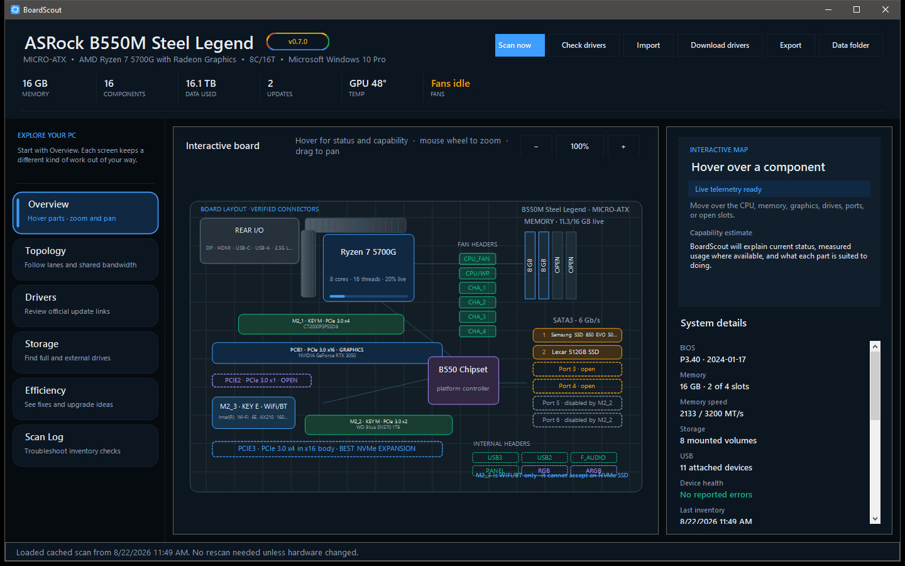

# BoardScout

BoardScout is a portable native C# desktop application for Windows hardware,
motherboard, storage, and driver health. It bundles the DriverScout engine and
does not require an installer, administrator rights, or a machine-wide .NET
runtime.

## Run

Double-click **BoardScout.cmd**. The launcher uses the matching portable build
for x64 or ARM64 Windows and builds it first when necessary.

You can also run the published executable directly:

    .\build\portable\win-x64\BoardScout.exe

## Interactive motherboard map

- BoardScout opens in a large, dark workspace with pill-shaped navigation on
  the left. Each destination explains what it is for before you open it.
- Hover over detected CPU, memory, graphics, storage, chipset, I/O, or expansion
  areas to see health, driver or capacity status, and a plain-language
  capability estimate.
- Supported board layouts explain lane sharing and disabled ports instead of
  presenting every connector as simultaneously available.
- The B550M Steel Legend layout identifies M2_3 as the installed AX210's M.2
  Key-E WiFi/Bluetooth socket, separate from the Key-M NVMe sockets.
- CPU and physical-memory utilization update locally once per second. Storage
  blocks show mounted-capacity usage; GPU usage is not claimed when Windows
  does not expose a reliable counter.
- Use the map buttons or mouse wheel to zoom from 100% to 250%. Drag the map to
  pan while zoomed, and click the percentage button to reset the view.

## Bandwidth topology

The Topology screen separates CPU-direct PCIe lanes from chipset-connected
devices. It shows the installed GPU, both NVMe drives, AX210 wireless card,
onboard LAN, SATA lane sharing, USB controllers, and the open PCIE2/PCIE3 slots.
Hover a node to see what the connection is suited for and which bandwidth is
shared.

## Efficient workflow

BoardScout deliberately separates work by cost:

1. **Startup uses the cached scan** and opens immediately.
2. **Scan now** performs local inventory only. Run it after hardware or
   firmware changes, not every time the app starts.
3. **Check Drivers** is a separate, cancellable online operation. It uses
   DriverScout resolvers for vendor, OEM, and Microsoft catalog comparisons.
4. The Drivers table and motherboard inspector link directly to official
   vendor, OEM, or Microsoft update pages.
5. BoardScout presents every update for review and **never installs or flashes
   anything automatically**.

The Efficiency screen looks for:

- memory running below its advertised XMP/DOCP/EXPO rate;
- critically full or nearly full volumes;
- Device Manager error codes;
- older BIOS firmware that merits a manual review;
- old driver dates, excluding Windows inbox disk.inf dates;
- update results verified by DriverScout sources.

## Portable build

Build the self-contained application and distribution zip:

    .\Build-Portable.ps1 -Runtime win-x64

Outputs:

- build\portable\win-x64\BoardScout.exe
- build\BoardScout-0.4.0-win-x64.zip

The portable folder includes the bundled DriverScout scripts and offline PCI/USB
ID databases. Zip that folder, move it to another Windows 10/11 PC, extract it,
and run **BoardScout.exe**.

If the application folder is writable, scans and reports stay in its **Data**
directory. If it is read-only, BoardScout falls back to
%LOCALAPPDATA%\BoardScout. Set BOARDSCOUT_DATA to override this location.

## Source layout

- src\BoardScout.App — .NET 8 WinForms application
- src\BoardScout.App\DriverScout — bundled DriverScout engine and notices
- src\BoardScout.App\Services — scanning, driver checks, caching, suggestions
- src\BoardScout.App\UI — native motherboard view and application screens
- Build-Portable.ps1 — self-contained publisher and zip packager

DriverScout is bundled under its own MIT license. See
src\BoardScout.App\DriverScout\LICENSE and THIRD-PARTY-NOTICES.md.

## Screenshot

## License

MIT — see [LICENSE](LICENSE).

## Third-party notices

See [THIRD-PARTY-NOTICES.md](THIRD-PARTY-NOTICES.md) for dependency licenses
and trademark attributions.

## Legal

BoardScout reads hardware identifiers reported by the operating system and
hardware firmware for diagnostic and informational purposes only. No
proprietary firmware, drivers, or copyrighted vendor materials are bundled
with or distributed by this software.

All product names, logos, and brands are property of their respective owners.
Use of these names does not imply affiliation with or endorsement by the
trademark holder. See THIRD-PARTY-NOTICES.md for the full trademark list.
