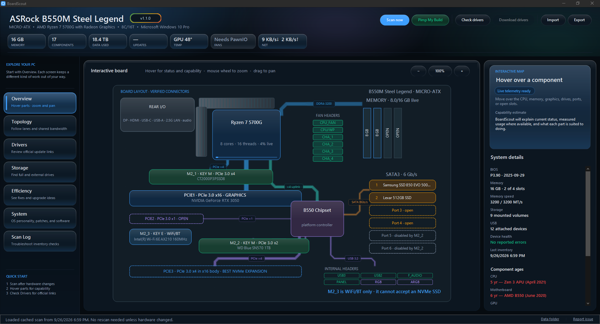
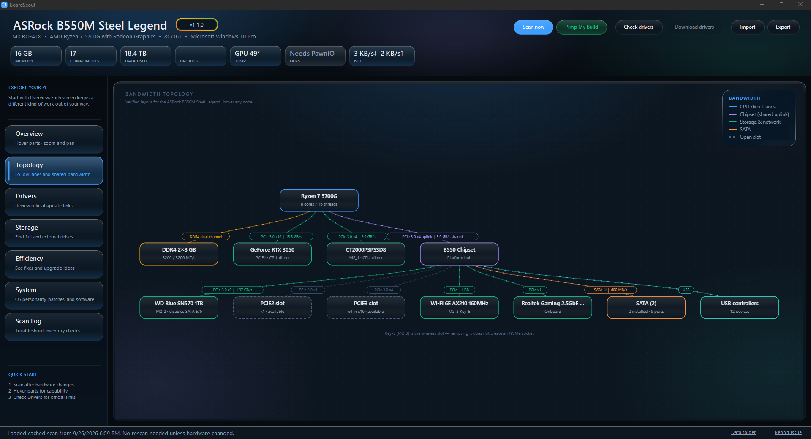
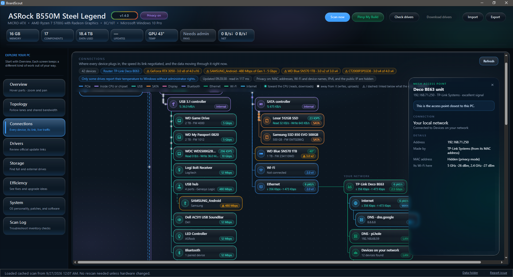
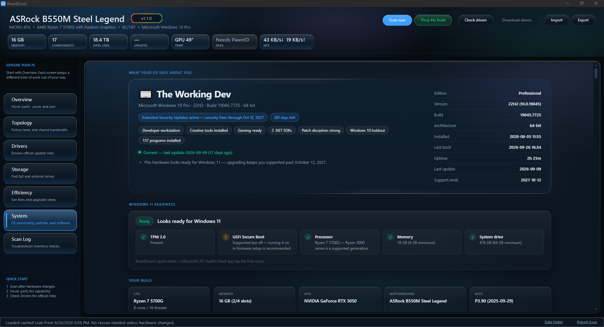
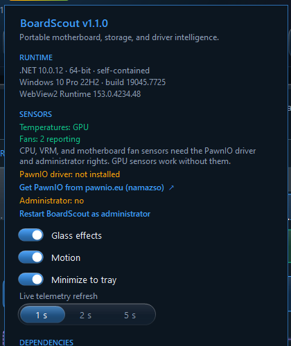

# BoardScout

A portable Windows app that maps your motherboard, bandwidth, drivers, storage, and operating
system in one place: what is plugged in where, what each part is good for, what needs attention,
and how long Windows will keep patching it. It never installs drivers or firmware.

**Status:** v1.4.0 (2026-09-27) · Windows 10/11 · .NET 10 · MIT license ·
[Download](https://github.com/mikedopp/BoardScout/releases/latest) · [Changelog](CHANGELOG.md)

## Download and run

From the [latest release](https://github.com/mikedopp/BoardScout/releases/latest):

| File | What it is |
| --- | --- |
| `BoardScout-1.4.0-win-x64.exe` | **Standalone.** One file with everything inside. Put it in any writable folder and run it. |
| `BoardScout-1.4.0-win-x64.zip` | **Portable folder.** Extract and run `BoardScout.exe`; keep `Assets` and `DriverScout` beside it. |
| `BoardScout-1.4.0-SHA256SUMS.txt` | Checksums for both. |

No installer, no admin rights, and no .NET install needed; the .NET 10 runtime is built in.
Scans, reports, settings, and the web views' profile live in a `Data` folder beside the exe. If
that folder is read-only, BoardScout uses `%LOCALAPPDATA%\BoardScout`; set `BOARDSCOUT_DATA` to
choose another folder. The standalone exe unpacks its bundled files to .NET's per-version cache
under `%TEMP%\.net` on first run.

## What you get

**Overview** — an interactive motherboard map. Hover the CPU, memory, graphics, drives, ports, or
open slots for status, live usage, and a plain-language capability estimate. Mouse wheel zooms
(it eases rather than jumps), drag pans. The ASRock B550M Steel Legend has a verified layout
(lane sharing, the M.2 Key-E Wi-Fi slot); other boards get the parts their scan reports.

**Topology** — CPU-direct lanes versus devices behind the chipset uplink, with flowing links that
move faster on wider buses. Board-specific slot names and lane sharing appear only for the verified
board; other boards get generic labels and the slots their firmware reports.

**Connections** — every device in the PC and exactly where it plugs in, read live from Windows'
device tree: the CPU, the chipset and what hangs off it, each USB controller, hub, and port, drives,
monitors, Bluetooth devices, network adapters, and on out through your router to the Internet.
Each card shows the link that device actually negotiated — PCIe generation and lanes, USB speed,
HDMI/DisplayPort mode, Ethernet or Wi-Fi rate — and flags links running below what the device
supports (a PCIe 4.0 SSD on PCIe 3.0 lanes, an NVMe drive given 2 of its 4 lanes, a USB 3 drive on a
USB 2 port) with the likely reason. Dots flow along the real paths as data moves: disk reads and
writes, and network traffic from the Internet through the router, the adapter, and the chipset to
the CPU. Cards show live speeds — network in Mbps with packets per second, drives in MB/s with IOPS —
and details add packets, discards, and errors since the adapter connected, and each drive's queue.
Click any card for details: link now versus best, live traffic, firmware and driver versions, drive
temperature where Windows reports it, IP and DNS settings, and the Wi-Fi network, signal, band, and
security. Plug something in and the map redraws itself.

It also puts **real names** on your network: the router's make and model (read from its own Wi-Fi
beacon, even when this PC is wired, or from its web certificate), how many mesh units are in range
and which is closest, Windows' name for the network and whether it is Public or Private, and the
other devices on it — named where they say who they are and labeled by maker from their MAC address
("CastTV · Vizio", "Ring camera", "Deco BE63 unit · excellent signal"). **Find more devices** pings
every address on your local network so quiet devices show up too. The Internet card can look up your
public IP and **test your Internet speed** (latency, download, upload), each only when you click.

**System** — "What your OS says about you": a personality verdict (The Power Developer, The
Reliable Holdout, The Battle Station, …), Windows support status from Microsoft's lifecycle
pages, patch health, a Windows 11 readiness check on Windows 10, your build, every .NET runtime
and SDK, and searchable tables of patches, installed software, and scheduled tasks.

**Drivers, Storage, Efficiency** — driver versions with links to official vendor, OEM, or Microsoft
update pages; every volume with its usage; and suggestions such as enabling XMP/DOCP/EXPO,
freeing space, or reviewing BIOS updates.

**Version button** — the chasing-colors version pill opens runtime details, sensor
troubleshooting, settings (privacy mode, glass effects, motion, live refresh, minimize to tray),
dependencies, requirements, and legal notices. *Copy diagnostics* gathers what an issue report needs.

## Sensors: why a temperature can be missing

BoardScout reads live sensors through LibreHardwareMonitorLib 0.9.6. That library reads CPU, VRM,
and motherboard fan sensors through the **PawnIO** driver (by namazso, https://pawnio.eu/), which
it does not ship, and those reads need **administrator rights**. Without both, only GPU
temperature and GPU fans are readable, and the header says what is missing ("Needs PawnIO" /
"Needs admin"). The version pop-out shows the current state, links to PawnIO, and can restart
BoardScout as administrator. Everything else in BoardScout works without either.

## What goes online

Only these, and only when you ask:

- **Check drivers** and **Download drivers** contact vendor, OEM, and Microsoft catalog sources.
- **Look up my public IP** on the Connections tab's Internet card sends one HTTPS request to
  Cloudflare (`https://1.1.1.1/cdn-cgi/trace`), which answers with the address your network uses on
  the Internet. BoardScout never makes this request on its own, and the Scan Log records each time
  it does.
- **Test my Internet speed** on the same card downloads and uploads test data from Cloudflare's
  public speed test (`speed.cloudflare.com`) for a few seconds — at most 400 MB down and 150 MB up,
  which only very fast connections reach — and the Scan Log records it.
- Links you click (official update pages, PawnIO, Report issue) open in your browser.

Everything else is local. Scans use built-in Windows tools, and the Topology, Connections, and
System views load their scripts (QuickLiquid, D3) from the app folder, not a CDN. To draw and name
your network, the Connections tab stays on your local network: it pings your router, reads the Wi-Fi
card's scan list (starting a scan if it is stale), opens a TLS handshake with your router's web
interface to read its certificate (it never logs in), asks devices for their names with the usual
local protocols (multicast DNS, NetBIOS, UPnP), asks your own DNS servers for reverse names, and
labels makers from the IEEE registry bundled with the app. **Find more devices** pings every address
on your local network, only when you click it. "Internet access" on that tab is what Windows' own
connectivity check already concluded.

## Privacy mode: screenshots and exports you can share

A scan knows things about your PC that a hardware report doesn't need: the PC name, the Windows
registered owner (often an email address), the Windows product ID, and motherboard, drive, and
memory serial numbers. Scans keep them on disk, and privacy mode keeps them out of what you share.

Turn it on under the version button → Settings, or press **Ctrl+Shift+P**. While it is on:

- A purple **Privacy on** chip appears in the header, so a screenshot shows it was taken masked.
  Click it to turn privacy mode off.
- The System tab hides the installed-software, patch, and scheduled-task lists (counts stay).
- The Scan Log shows `THIS-PC` and `%USERPROFILE%` instead of your PC name and user folder.
- Storage shows `Volume D:` instead of volume labels you named yourself.
- Spec sheet and JSON exports leave out the PC name, machine ID, serial numbers, system UUID,
  and volume labels. JSON exports stay importable.
- Connections hides MAC addresses, Wi-Fi network names and access-point addresses, IPv6
  addresses, the names devices on your network give themselves (they show by type and maker, like
  "Vizio TV or streamer"), the router's own name for itself, Bluetooth device names that look like
  someone's ("Sam's AirPods"), the public IP, and the speed test's server location.

Two protections apply even with privacy mode off: JSON exports never include the Windows owner or
product ID, and **Copy diagnostics** always masks your PC name, user folder, serials, emails, and
MAC addresses.

## How BoardScout keeps work cheap

1. Startup shows the latest cached scan immediately.
2. **Scan now** is a local inventory (about 10 s). Run it after hardware or firmware changes.
3. **Check drivers** is a separate, cancellable online step.
4. Live telemetry (CPU, memory, sensors, network) runs on a background thread at the refresh rate
   you choose, so the window never waits on hardware. Per-disk and per-adapter rates are sampled
   only while the Connections map is on screen.
5. Web views on tabs you are not looking at, or while the window is minimized, are paused.
6. BoardScout presents updates for review and **never installs or flashes anything**.

## Troubleshooting

- **Version button → Copy diagnostics** puts version, runtime, Windows build, WebView2, sensor
  state, and settings on the clipboard for an issue report.
- Unexpected errors are written to `crash.log` in the data folder.
- `BoardScout.exe --system-json` prints the System tab's data; `--connections-json` prints the
  Connections map with network names (add `--privacy` to mask it as privacy mode does, `--sweep` to
  search the network like *Find more devices*); `--scan` runs a headless scan; `--check-drivers` also
  checks drivers.
- Topology, Connections, and System need the Microsoft Edge WebView2 Runtime (built into Windows 11
  and current Windows 10). Without it those views say so; the rest works.
- A drive with no temperature on Connections is normal: without administrator rights, Windows
  reports temperature only for some drives (usually NVMe).

## Build from source

Requires the .NET 10 SDK on Windows.

    .\Build-Portable.ps1 -Runtime win-x64

This produces `build\BoardScout-<version>-win-x64.zip` (portable folder),
`build\BoardScout-<version>-win-x64.exe` (standalone), and a SHA-256 checksum file. The version
comes from `src\BoardScout.App\BoardScout.App.csproj`. `BoardScout.cmd` builds on first use and
then launches the portable build.

Source layout:

- `src\BoardScout.App` — the .NET 10 Windows Forms application
- `src\BoardScout.App\UI` — board map, liquid sidebar, glass controls, version pop-out
- `src\BoardScout.App\Services` — scanning, driver checks, telemetry, System tab data, the device
  tree, network probe, and Connections map
- `src\BoardScout.App\Assets` — Topology, Connections, and System web views, plus `vendor\` (QuickLiquid, D3)
- `src\BoardScout.App\DriverScout` — the bundled PowerShell scan engine and its notices

## License and legal

MIT — see [LICENSE](LICENSE). Bundled components keep their own licenses: see
[THIRD-PARTY-NOTICES.md](THIRD-PARTY-NOTICES.md), which also lists trademark attributions.

BoardScout reads hardware identifiers that Windows and firmware report, for diagnostic and
informational purposes only. No proprietary firmware, drivers, or copyrighted vendor materials are
bundled or distributed. Windows lifecycle dates reflect Microsoft's published pages as of
2026-09-26 and can change; the Windows 11 readiness result is BoardScout's quick check, and
Microsoft's PC Health Check app has the final word. Upgrade prices in the Pimp My Build report are
rough estimates, not offers. All product names and brands belong to their respective owners, and
their use does not imply affiliation or endorsement.
